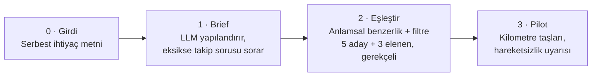

# 🪡 Needle

**Needs & Leads için açık kaynak eşleştirme ve pilot takip platformu**

Kurumun dağınık ihtiyaç metnini yapılandırılmış bir brief'e çevirir, o brief'i uygun girişimlerle
**gerekçesiyle** eşleştirir ve eşleşme sonrası pilot sürecini ölçülebilir şekilde takip eder.

---

## Problem

Bir kurumun inovasyon sorumlusu şunu yazıyor:

> "Sahadaki bayilerimizden gelen şikayetleri daha hızlı sınıflandırmak istiyoruz, çok manuel gidiyor."

Bu cümle bir girişim için kullanılamaz: kaç şikayet, hangi formatta, hangi sistemde, bütçe ne,
başarı kriteri ne? Bugün bu boşluğu bir insan dolduruyor. Program yöneticisi ihtiyacı deşifre
ediyor, kafasındaki listeden birkaç girişim çıkarıyor, tanıştırıyor ve pilotu Excel'de takip
ediyor. O kişi giderse bilgi de gidiyor.

**Asıl problem tanıştırmak değil, tanıştırdıktan sonra ne olduğunu bilmemek.**

## Nasıl çalışır

| Adım | Ne oluyor | Çıktı |
|---|---|---|
| **0 · Girdi** | Kurum ihtiyacını serbest metin olarak yazar | Dağınık, eksik bir paragraf |
| **1 · Brief'e çevir** | LLM metni yapılandırır; eksik alan varsa 2–3 takip sorusu sorar | Problem, kapsam, gereken yetkinlikler, süre, başarı kriteri |
| **2 · Eşleştir** | Brief embed edilir; profil havuzunda anlamsal benzerlik + filtre (sektör, olgunluk, lokasyon) | 5 uygun aday + 3 elenen aday, her biri gerekçesiyle |
| **3 · Pilotu takip et** | Eşleşme kabul edilince otomatik pilot kartı açılır | Kilometre taşları, durum, hareketsizlik uyarısı, haftalık özet |

## Neden farklı

Açık inovasyon platformu kategorisinde olgun ürünler var (Skipso, Innoget, Ambivation).
Needle'ın farkı kategori değil, **uyum**:

- **Gerekçeli eşleşme:** Her eşleşmede hangi cümlenin hangi yetkinlikle örtüştüğünün izi tutulur.
- **Negatif eşleşme:** "Yakındı ama olmadı, çünkü X" kaydı. Elenenler de gerekçesiyle saklanır.
- **Pilot erken uyarısı:** "12 gündür hareketsiz" uyarısı. Pilotlar sessizce ölmesin.
- **Türkçe ve açık kaynak:** Zemin360'ın Needs & Leads akışına göre kurgulandı, İSTKA raporlamasına doğrudan çıktı verecek şekilde tasarlandı.

## Teknoloji

| Katman | Seçim |
|---|---|
| LLM orkestrasyon | LangGraph + Gemini |
| Vektör arama | PostgreSQL + pgvector |
| Frontend | React + hazır component kütüphanesi |
| Dağıtım | Docker |

## Kapsam

Bilinçli olarak yalnızca yukarıdaki dört adım kodlanıyor. Mesajlaşma, bildirim, profil doğrulama,
rozet, sosyal ağ ve mobil uygulama [yol haritasında](#yol-haritası) duruyor.

## Yol haritası

- [ ] Veri modeli + brief üretimi (Adım 1)
- [ ] Eşleştirme motoru, gerekçeli skor ve negatif eşleşme (Adım 2)
- [ ] Pilot tracker (Adım 3)
- [ ] Demo modu (cache'li LLM cevapları)
- [ ] Kapalı döngü: pilot sonucunun sonraki eşleştirmelerin ağırlığına geri dönmesi
- [ ] İhtiyacı yazan birim ile ihtiyacı yaşayan saha birimini ayrıştırma

## Kurulum

> Proje aktif geliştirme aşamasında. Kurulum adımları ilk çalışan sürümle birlikte eklenecek.

## Katkı

Katkı rehberi için [CONTRIBUTING.md](CONTRIBUTING.md) dosyasına bak.

## Lisans

[Apache License 2.0](LICENSE)
